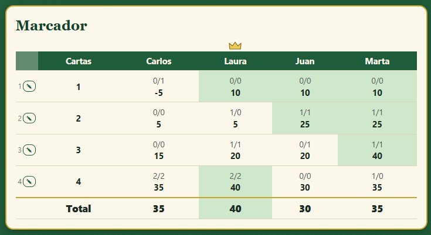

# Contador de Pocha

Aplicación web para llevar la puntuación de la **Pocha**, el juego de cartas con baraja española. Funciona en el móvil y en el ordenador, se puede instalar como una app y no necesita conexión para jugar.

**Pruébala aquí:** <https://carlos-vi.github.io/contador-pocha/>



## Cómo se usa
1. Pulsa **Nueva partida**, elige de 3 a 6 jugadores, escribe los nombres y decide quién reparte primero (o al azar).
2. En cada ronda anota lo que **pide** cada jugador y, al terminarla, las **bazas hechas**. La app calcula los puntos.
3. El marcador muestra ronda a ronda lo pedido y lo hecho, el total acumulado y una corona sobre quien va ganando.
4. Puedes corregir una ronda anterior con el botón ✎, terminar la partida antes de tiempo y ver sus **estadísticas** (evolución de puntos, bazas pedidas y hechas, fallos).
5. Las partidas quedan guardadas y puedes retomarlas cuando quieras.

### Instalarla en el móvil
- **Android (Chrome):** menú de los tres puntos > *Instalar aplicación* o *Añadir a pantalla de inicio*.
- **iPhone (Safari):** botón de compartir > *Añadir a pantalla de inicio*.

### Usarla en varios dispositivos
Las partidas se guardan en el navegador de cada dispositivo. Si quieres verlas en el móvil y en el ordenador, pulsa **Entrar con Google** en la pantalla de inicio: las partidas se copian a la nube y se sincronizan entre los dispositivos donde inicies sesión. Es opcional; sin sesión todo funciona igual, solo en ese dispositivo.

Limitaciones: si borras una partida sin sesión iniciada, no se borra en la nube; y si abres la misma partida en dos dispositivos a la vez, prevalece el último cambio guardado.

## Reglas implementadas
- 3 a 6 jugadores. Cartas máximas por ronda = `floor(40 / jugadores)` (tope 13).
- Rondas: 1, 2, …, máximo-1, luego el máximo repetido una vez por jugador (cada uno reparte una vez), y de nuevo bajando hasta 1.
- Puntos: acierto = 10 + 5 por baza; fallo = -5 por cada baza de diferencia.
- El repartidor pide el último y no puede pedir una cifra que haga que la suma de lo pedido sea igual al número de cartas. El reparto rota cada ronda.

---

## Para desarrolladores
HTML, CSS y JavaScript puros, sin build ni gestor de paquetes. La sincronización en la nube (Firebase) es opcional.

### Estructura
| Archivo | Función |
|---|---|
| `index.html` | Página única: cabecera y contenedor donde se pinta todo |
| `styles.css` | Estilos (tapete verde, crema y dorado) |
| `logic.js` | Lógica pura sin DOM: rondas, puntos, orden de apuestas, estadísticas. Se usa desde el navegador y desde Node |
| `app.js` | Interfaz: inicio con partidas guardadas, configuración, ronda, marcador, fin y estadísticas (gráficos SVG). Guarda en `localStorage` (clave `pocha-partidas-v2`) y, con sesión iniciada, sincroniza con la nube |
| `test.js` | Tests de `logic.js` |
| `manifest.webmanifest`, `sw.js`, `icon.svg` | PWA: instalación en el móvil y funcionamiento sin conexión |
| `nube.js`, `firebase-config.js`, `firestore.rules` | Sincronización opcional con Firebase |

### Ejecutarla en local
Desde la carpeta del proyecto:
```
python -m http.server 8000
```
y abrir <http://localhost:8000>. También vale abrir `index.html` con doble clic, pero el service worker no se activa con `file://`.

### Tests
Requieren Node.js:
```
node test.js
```

### Configurar tu propio Firebase
`firebase-config.js` apunta al proyecto de Firebase de esta app. Si haces una copia del código, sustituye esos valores por los de tu propio proyecto; si dejas `PEGA_AQUI`, la sincronización se desactiva y la app funciona solo en local.

Cómo funciona: la app trabaja siempre con la copia local y sube en segundo plano las partidas que cambian a `usuarios/{uid}/partidas/{id}` en Firestore. Si una partida se modifica en dos sitios, gana la modificada más recientemente. Cada usuario solo puede leer y escribir lo suyo (`firestore.rules`).

Configuración, una sola vez (en <https://console.firebase.google.com>):
1. Crear un proyecto (plan Spark, sin tarjeta) y añadir una app web.
2. Copiar `apiKey`, `authDomain`, `projectId` y `appId` a `firebase-config.js`. Son claves públicas de cliente; lo que protege los datos son las reglas.
3. Authentication > Sign-in method: activar **Google**.
4. Authentication > Settings > Authorized domains: añadir el dominio donde se publique la app. `localhost` ya viene incluido.
5. Firestore Database: crear la base de datos en modo producción y pegar el contenido de `firestore.rules` en la pestaña Reglas.
6. Recomendado: en Google Cloud Console, restringir la clave de API a los dominios de la app.
